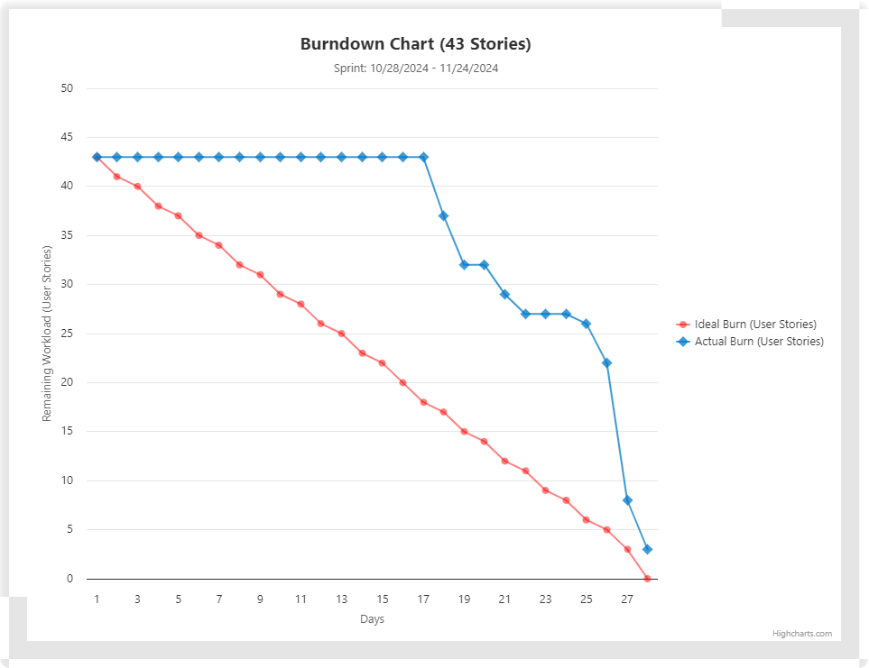

# Burndown Chart

A burndown chart is a graphical representation of work left to do versus time. It is useful for tracking the progress of a project and predicting its completion date.

## Sprint B Burndown Chart

## How to Read the Burndown Chart

- **X-Axis**: Represents the time (days).
- **Y-Axis**: Represents the amount of work remaining (story points).
- **Ideal Line**: A straight line from the start point to the end point, representing the ideal progress.
- **Actual Line**: A line showing the actual progress of the team.

## Benefits of Using a Burndown Chart

- **Visibility**: Provides a clear visual of the team's progress.
- **Predictability**: Helps in predicting the completion date of the project.
- **Motivation**: Encourages the team to stay on track and meet deadlines.

## Conclusion

Burndown charts are an essential tool in agile project management, helping teams to monitor their progress and stay on track.
