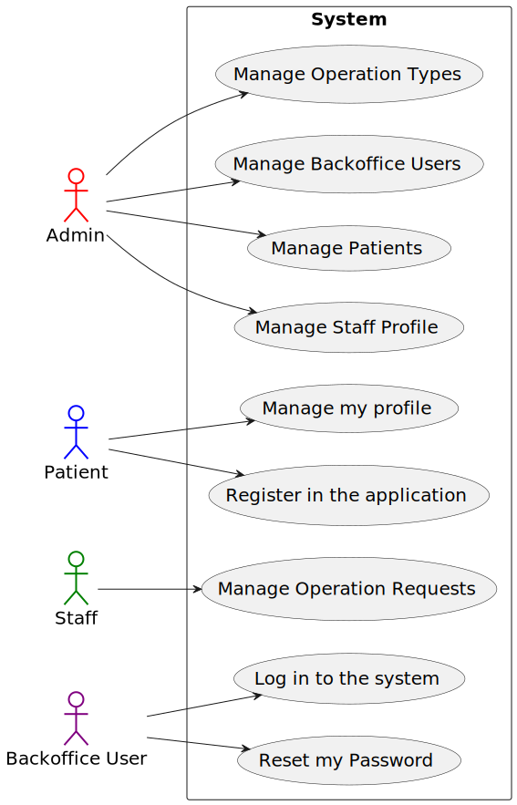

# Use Case Diagram (UCD)

# Use Cases / User Stories

| UC/US | Description |
| ----- | ----------- |
| **5.1.1** | [_`As an Admin, I want to register new backoffice users - POST`_](../../sprint_A/us_5.1.1/readme.md) |
| **5.1.2** | [_`As a Backoffice User, I want to reset my password if I forget it - PUT/PATCH`_](../../sprint_A/us_5.1.2/readme.md) |
| **5.1.3** | [_`As a Patient, I want to register for the healthcare application - POST`_](../../sprint_A/us_5.1.3/readme.md) |
| **5.1.4** | [_`As a Patient, I want to update my user profile - PUT/PATCH`_](../../sprint_A/us_5.1.4/readme.md) |
| **5.1.5** | [_`As a Patient, I want to delete my account and all associated data - DELETE`_](../../sprint_A/us_5.1.5/readme.md) |
| **5.1.6** | [_`As a (non-authenticated) Backoffice User, I want to log in to the system using my credentials - POST`_](../../sprint_A/us_5.1.6/readme.md) |
| **5.1.7** | [_`As a Patient, I want to log in to the healthcare system using IAM - POST`_](../../sprint_A/us_5.1.7/readme.md) |
| **5.1.8** | [_`As an Admin, I want to create a new patient profile - POST`_](../../sprint_A/us_5.1.8/readme.md) |
| **5.1.9** | [_`As an Admin, I want to edit an existing patient profile - PUT/PATCH`_](../../sprint_A/us_5.1.9/readme.md) |
| **5.1.10** | [_`As an Admin, I want to delete a patient profile - DELETE`_](../../sprint_A/us_5.1.10/readme.md) |
| **5.1.11** | [_`As an Admin, I want to list/search patient profiles by different attributes - GET`_](../../sprint_A/us_5.1.11/readme.md) |
| **5.1.12** | [_`As an Admin, I want to create a new staff profile - POST`_](../../sprint_A/us_5.1.12/readme.md) |
| **5.1.13** | [_`As an Admin, I want to edit a staff’s profile - PUT/PATCH`_](../../sprint_A/us_5.1.13/readme.md) |
| **5.1.14** | [_`As an Admin, I want to deactivate a staff profile - PUT/PATCH`_](../../sprint_A/us_5.1.14/readme.md) |
| **5.1.15** | [_`As an Admin, I want to list/search staff profiles - GET`_](../../sprint_A/us_5.1.15/readme.md) |
| **5.1.16** | [_`As a Doctor, I want to request an operation - POST`_](../../sprint_A/us_5.1.16/readme.md) |
| **5.1.17** | [_`As a Doctor, I want to update an operation requisition - PUT/PATCH`_](../../sprint_A/us_5.1.17/readme.md) |
| **5.1.18** | [_`As a Doctor, I want to remove an operation requisition - DELETE`_](../../sprint_A/us_5.1.18/readme.md) |
| **5.1.19** | [_`As a Doctor, I want to list/search operation requisitions - GET`_](../../sprint_A/us_5.1.19/readme.md) |
| **5.1.20** | [_`As an Admin, I want to add new types of operations - POST`_](../../sprint_A/us_5.1.20/readme.md) |
| **5.1.21** | [_`As an Admin, I want to edit existing operation types - PUT/PATCH`_](../../sprint_A/us_5.1.21/readme.md) |
| **5.1.22** | [_`As an Admin, I want to remove obsolete or no longer performed operation types - DELETE`_](../../sprint_A/us_5.1.22/readme.md) |
| **5.1.23** | [_`As an Admin, I want to list/search operation types - GET`_](../../sprint_A/us_5.1.23/readme.md) |

