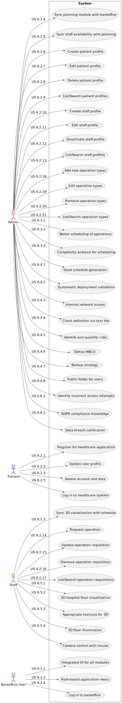
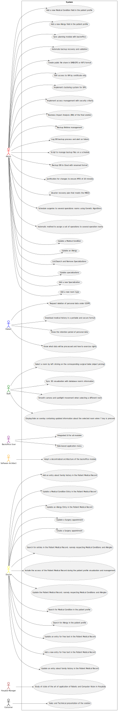

# Use Case Diagram (UCD) - Sprint A

# Use Cases / User Stories Sprint A

| UC/US | Description |
| ----- | ----------- |
| **5.1.1** | [_`As an Admin, I want to register new backoffice users - POST`_](../../sprint_A/us_5.1.1/readme.md) |
| **5.1.2** | [_`As a Backoffice User, I want to reset my password if I forget it - PUT/PATCH`_](../../sprint_A/us_5.1.2/readme.md) |
| **5.1.3** | [_`As a Patient, I want to register for the healthcare application - POST`_](../../sprint_A/us_5.1.3/readme.md) |
| **5.1.4** | [_`As a Patient, I want to update my user profile - PUT/PATCH`_](../../sprint_A/us_5.1.4/readme.md) |
| **5.1.5** | [_`As a Patient, I want to delete my account and all associated data - DELETE`_](../../sprint_A/us_5.1.5/readme.md) |
| **5.1.6** | [_`As a (non-authenticated) Backoffice User, I want to log in to the system using my credentials - POST`_](../../sprint_A/us_5.1.6/readme.md) |
| **5.1.7** | [_`As a Patient, I want to log in to the healthcare system using IAM - POST`_](../../sprint_A/us_5.1.7/readme.md) |
| **5.1.8** | [_`As an Admin, I want to create a new patient profile - POST`_](../../sprint_A/us_5.1.8/readme.md) |
| **5.1.9** | [_`As an Admin, I want to edit an existing patient profile - PUT/PATCH`_](../../sprint_A/us_5.1.9/readme.md) |
| **5.1.10** | [_`As an Admin, I want to delete a patient profile - DELETE`_](../../sprint_A/us_5.1.10/readme.md) |
| **5.1.11** | [_`As an Admin, I want to list/search patient profiles by different attributes - GET`_](../../sprint_A/us_5.1.11/readme.md) |
| **5.1.12** | [_`As an Admin, I want to create a new staff profile - POST`_](../../sprint_A/us_5.1.12/readme.md) |
| **5.1.13** | [_`As an Admin, I want to edit a staff’s profile - PUT/PATCH`_](../../sprint_A/us_5.1.13/readme.md) |
| **5.1.14** | [_`As an Admin, I want to deactivate a staff profile - PUT/PATCH`_](../../sprint_A/us_5.1.14/readme.md) |
| **5.1.15** | [_`As an Admin, I want to list/search staff profiles - GET`_](../../sprint_A/us_5.1.15/readme.md) |
| **5.1.16** | [_`As a Doctor, I want to request an operation - POST`_](../../sprint_A/us_5.1.16/readme.md) |
| **5.1.17** | [_`As a Doctor, I want to update an operation requisition - PUT/PATCH`_](../../sprint_A/us_5.1.17/readme.md) |
| **5.1.18** | [_`As a Doctor, I want to remove an operation requisition - DELETE`_](../../sprint_A/us_5.1.18/readme.md) |
| **5.1.19** | [_`As a Doctor, I want to list/search operation requisitions - GET`_](../../sprint_A/us_5.1.19/readme.md) |
| **5.1.20** | [_`As an Admin, I want to add new types of operations - POST`_](../../sprint_A/us_5.1.20/readme.md) |
| **5.1.21** | [_`As an Admin, I want to edit existing operation types - PUT/PATCH`_](../../sprint_A/us_5.1.21/readme.md) |
| **5.1.22** | [_`As an Admin, I want to remove obsolete or no longer performed operation types - DELETE`_](../../sprint_A/us_5.1.22/readme.md) |
| **5.1.23** | [_`As an Admin, I want to list/search operation types - GET`_](../../sprint_A/us_5.1.23/readme.md) |

# Use Case Diagram (UCD) - Sprint B

# Use Cases / User Stories Sprint B

| UC/US | Description |
| ----- | ----------- |
| **6.1.1** | [_`As user, I want to have an integrated UI`_](../../sprint_B/us_6.1.1/readme.md) |
| **6.1.2** | [_`As user I want the application menu to adjust according to my role`_](../../sprint_B/us_6.1.2/readme.md) |
| **6.1.3** | [_`As healthcare staff I want the information shown on the 3D visualization module to be in sync with the schedule`_](../../sprint_B/us_6.1.3/readme.md) |
| **6.1.4** | [_`As Admin I want the information about healthcare staff, operation types, and operation requests to be in sync with the backoffice module`_](../../sprint_B/us_6.1.4/readme.md) |
| **6.1.5** | [_`As Admin I want the information about staff’s availability and operation schedule to be in sync with the planning module`_](../../sprint_B/us_6.1.5/readme.md) |
| **6.2.1** | [_`As a Patient, I want to register for the healthcare application`_](../../sprint_B/us_6.2.1/readme.md) |
| **6.2.2** | [_`As a Patient, I want to update my user profile`_](../../sprint_B/us_6.2.2/readme.md) |
| **6.2.3** | [_`As a Patient, I want to delete my account and all associated data`_](../../sprint_B/us_6.2.3/readme.md) |
| **6.2.4** | [_`As a (non-authenticated) Backoffice User, I want to log in to the system`_](../../sprint_B/us_6.2.4/readme.md) |
| **6.2.5** | [_`As a Patient, I want to log in to the healthcare system`_](../../sprint_B/us_6.2.5/readme.md) |
| **6.2.6** | [_`As an Admin, I want to create a new patient profile`_](../../sprint_B/us_6.2.6/readme.md) |
| **6.2.7** | [_`As an Admin, I want to edit an existing patient profile`_](../../sprint_B/us_6.2.7/readme.md) |
| **6.2.8** | [_`As an Admin, I want to delete a patient profile`_](../../sprint_B/us_6.2.8/readme.md) |
| **6.2.9** | [_`As an Admin, I want to list/search patient profiles by different attributes`_](../../sprint_B/us_6.2.9/readme.md) |
| **6.2.10** | [_`As an Admin, I want to create a new staff profile`_](../../sprint_B/us_6.2.10/readme.md) |
| **6.2.11** | [_`As an Admin, I want to edit a staff’s profile`_](../../sprint_B/us_6.2.11/readme.md) |
| **6.2.12** | [_`As an Admin, I want to deactivate a staff profile`_](../../sprint_B/us_6.2.12/readme.md) |
| **6.2.13** | [_`As an Admin, I want to list/search staff profiles`_](../../sprint_B/us_6.2.13/readme.md) |
| **6.2.14** | [_`As a Doctor, I want to request an operation`_](../../sprint_B/us_6.2.14/readme.md) |
| **6.2.15** | [_`As a Doctor, I want to update an operation requisition`_](../../sprint_B/us_6.2.15/readme.md) |
| **6.2.16** | [_`As a Doctor, I want to remove an operation requisition`_](../../sprint_B/us_6.2.16/readme.md) |
| **6.2.17** | [_`As a Doctor, I want to list/search operation requisitions`_](../../sprint_B/us_6.2.17/readme.md) |
| **6.2.18** | [_`As an Admin, I want to add new types of operations`_](../../sprint_B/us_6.2.18/readme.md) |
| **6.2.19** | [_`As an Admin, I want to edit existing operation types`_](../../sprint_B/us_6.2.19/readme.md) |
| **6.2.20** | [_`As an Admin, I want to remove obsolete or no longer performed operation types`_](../../sprint_B/us_6.2.20/readme.md) |
| **6.2.21** | [_`As an Admin, I want to list/search operation types`_](../../sprint_B/us_6.2.21/readme.md) |
| **6.3.1** | [_`As an Admin, I want to obtain the better scheduling of a set of operations`_](../../sprint_B/us_6.3.1/readme.md) |
| **6.3.2** | [_`As an Admin, I want to know till what dimension in terms of number of surgeries is possible to ask for the better solution`_](../../sprint_B/us_6.3.2/readme.md) |
| **6.3.3** | [_`As an Admin, I want to obtain a good schedule, not necessarily the better, in useful time`_](../../sprint_B/us_6.3.3/readme.md) |
| **6.4.1** | [_`As system administrator, I want the deployment of one of the RFP modules in a DEI VM to be systematic`_](../../sprint_B/us_6.4.1/readme.md) |
| **6.4.2** | [_`As system administrator, I only want clients on the DEI's internal network to be able to access the solution`_](../../sprint_B/us_6.4.2/readme.md) |
| **6.4.3** | [_`As system administrator, I want the clients listed in the requirement 6.3.2 to be able to be defined by simply changing a text file`_](../../sprint_B/us_6.4.3/readme.md) |
| **6.4.4** | [_`As an administrator, I want to identify and quantify the risks involved in the recommended solution`_](../../sprint_B/us_6.4.4/readme.md) |
| **6.4.5** | [_`As system administrator, I want to define the MBCO to propose to stakeholders`_](../../sprint_B/us_6.4.5/readme.md) |
| **6.4.6** | [_`As system administrator, I want a backup strategy to be proposed, justified and implemented`_](../../sprint_B/us_6.4.6/readme.md) |
| **6.4.7** | [_`As system administrator I want to define a public folder for all users`_](../../sprint_B/us_6.4.7/readme.md) |
| **6.4.8** | [_`As system administrator I want to get users with more than 3 incorrect access attempts`_](../../sprint_B/us_6.4.8/readme.md) |
| **6.5.1** | [_`As a healthcare staff member, I want to see a 3D representation of the hospital/clinic floor`_](../../sprint_B/us_6.5.1/readme.md) |
| **6.5.2** | [_`As a healthcare staff member, I want to see appropriate textures mapped onto the floor, walls, and so on`_](../../sprint_B/us_6.5.2/readme.md) |
| **6.5.3** | [_`As a healthcare staff member, I want to see the hospital/clinic floor illuminated with ambient and directional light`_](../../sprint_B/us_6.5.3/readme.md) |
| **6.5.4** | [_`As a healthcare staff member, I want to control the camera with the mouse`_](../../sprint_B/us_6.5.4/readme.md) |
| **6.6.1** | [_`As the entity that will implement the technical solution, I want to be sure that the team has good knowledge of the project`_](../../sprint_B/us_6.6.1/readme.md) |
| **6.6.2** | [_`As a System, I want to notify both users and the responsible authority in case of a data breach`_](../../sprint_B/us_6.6.2/readme.md) |

# Use Case Diagram (UCD) - Sprint C

# Use Cases / User Stories Sprint C

| UC/US | Description |
| ----- | ----------- |
| **7.1.1** | [_`As user, I want to have an integrated UI`_](../../sprint_C/us_7.1.1/readme.md) |
| **7.1.2** | [_`As user I want the application menu to adjust according to my role`_](../../sprint_C/us_7.1.2/readme.md) |
| **7.1.3** | [_`As healthcare staff I want the information shown on the 3D visualization module to be in sync with the database room's information`_](../../sprint_C/us_7.1.3/readme.md) |
| **7.1.4** | [_`As Admin I want the information about healthcare staff, operation types, and operation requests to be in sync with the backoffice module`_](../../sprint_C/us_7.1.4/readme.md) |
| **7.1.5** | [_`As Customer, I want a sales and technical presentation of the solution`_](../../sprint_C/us_7.1.5/readme.md) |
| **7.2.1** | [_`As a Software Architect, I want to adopt a decentralized architecture of the backoffice module`_](../../sprint_C/us_7.2.1/readme.md) |
| **7.2.2** | [_`As an Admin, I want to add a new Allergy field in the patient profile`_](../../sprint_C/us_7.2.2/readme.md) |
| **7.2.3** | [_`As a Doctor, I want to search for Allergy in the patient profile`_](../../sprint_C/us_7.2.3/readme.md) |
| **7.2.4** | [_`As an Admin, I want to add a new Medical Condition field in the patient profile`_](../../sprint_C/us_7.2.4/readme.md) |
| **7.2.5** | [_`As a Doctor, I want to search for Medical Condition in the patient profile`_](../../sprint_C/us_7.2.5/readme.md) |
| **7.2.6** | [_`As a Doctor, I want to update the Patient Medical Record, namely respecting Medical Conditions and Allergies`_](../../sprint_C/us_7.2.6/readme.md) |
| **7.2.7** | [_`As a Doctor, I want to search for entries in the Patient Medical Record, namely respecting Medical Conditions and Allergies`_](../../sprint_C/us_7.2.7/readme.md) |
| **7.2.8** | [_`As a Doctor, I want to create a Surgery appointment`_](../../sprint_C/us_7.2.8/readme.md) |
| **7.2.9** | [_`As a Doctor, I want to update a Surgery appointment`_](../../sprint_C/us_7.2.9/readme.md) |
| **7.2.10** | [_`As an Admin, I want to add a new room type`_](../../sprint_C/us_7.2.10/readme.md) |
| **7.2.11** | [_`As an Admin, I want to add a new Specialization`_](../../sprint_C/us_7.2.11/readme.md) |
| **7.2.13** | [_`As an Admin, I want to update specializations`_](../../sprint_C/us_7.2.13/readme.md) |
| **7.2.14** | [_`As a Doctor, I want to include the access of the Patient Medical Record during the patient profile visualization and management`_](../../sprint_C/us_7.2.14/readme.md) |
| **7.2.15** | [_`As an Admin, I want to list/search and remove specializations`_](../../sprint_C/us_7.2.15/readme.md) |
| **7.2.16** | [_`As an Admin, I want to update an Allergy`_](../../sprint_C/us_7.2.16/readme.md) |
| **7.2.17** | [_`As an Admin, I want to update a Medical Condition`_](../../sprint_C/us_7.2.17/readme.md) |
| **7.2.18** | [_`As a Doctor, I want to update an Allergy Entry in the Patient Medical Record`_](../../sprint_C/us_7.2.18/readme.md) |
| **7.2.19** | [_`As a Doctor, I want to update a Medical Condition Entry in the Patient Medical Record`_](../../sprint_C/us_7.2.19/readme.md) |
| **7.2.20** | [_`As a Doctor, I want to add an entry about family history in the Patient Medical Record`_](../../sprint_C/us_7.2.20/readme.md) |
| **7.2.21** | [_`As a Doctor, I want to update an entry about family history in the Patient Medical Record`_](../../sprint_C/us_7.2.21/readme.md) |
| **7.2.22** | [_`As a Doctor, I want to add a new entry for free text in the Patient Medical Record`_](../../sprint_C/us_7.2.22/readme.md) |
| **7.2.23** | [_`As a Doctor, I want to update an entry for free text in the Patient Medical Record`_](../../sprint_C/us_7.2.23/readme.md) |
| **7.3.1** | [_`As an Admin, I want an automatic method to assign a set of operations to several operation rooms`_](../../sprint_C/us_7.3.1/readme.md) |
| **7.3.2** | [_`As an Admin, I want to schedule surgeries to several operations rooms using Genetic Algorithms`_](../../sprint_C/us_7.3.2/readme.md) |
| **7.3.3** | [_`As a Hospital Manager, I want a study of state of the art of application of Robots and Computer Vision in Hospitals`_](../../sprint_C/us_7.3.3/readme.md) |
| **7.4.1** | [_`As an Admin, I want a disaster recovery plan that meets the MBCO`_](../../sprint_C/us_7.4.1/readme.md) |
| **7.4.2** | [_`As an Admin, I want justification for changes to ensure MTD of 20 minutes`_](../../sprint_C/us_7.4.2/readme.md) |
| **7.4.3** | [_`As an Admin, I want to backup DB to Cloud with renamed format`_](../../sprint_C/us_7.4.3/readme.md) |
| **7.4.4** | [_`As an Admin, I want a script to manage backup files on a schedule`_](../../sprint_C/us_7.4.4/readme.md) |
| **7.4.5** | [_`As an Admin, I want to log DB backup process and alert on failure`_](../../sprint_C/us_7.4.5/readme.md) |
| **7.4.6** | [_`As an Admin, I want backup lifetime management`_](../../sprint_C/us_7.4.6/readme.md) |
| **7.4.7** | [_`As an Admin, I want a Business Impact Analysis (BIA) of the final solution`_](../../sprint_C/us_7.4.7/readme.md) |
| **7.4.8** | [_`As an Admin, I want to implement access management with security criteria`_](../../sprint_C/us_7.4.8/readme.md) |
| **7.4.9** | [_`As an Admin, I want to implement clustering system for SPA`_](../../sprint_C/us_7.4.9/readme.md) |
| **7.4.10** | [_`As an Admin, I want SSH access to VM by certificate only`_](../../sprint_C/us_7.4.10/readme.md) |
| **7.4.11** | [_`As an Admin, I want to create public file share in SMB/CIFS or NFS format`_](../../sprint_C/us_7.4.11/readme.md) |
| **7.4.12** | [_`As an Admin, I want to automate backup recovery and validation`_](../../sprint_C/us_7.4.12/readme.md) |
| **7.5.1** | [_`As healthcare staff, I want to select a room by left clicking on the corresponding surgical table (object picking)`_](../../sprint_C/us_7.5.1/readme.md) |
| **7.5.2** | [_`As healthcare staff, I want to display/hide an overlay containing updated information about the selected room when 'i' key is pressed`_](../../sprint_C/us_7.5.2/readme.md) |
| **7.5.4** | [_`As healthcare staff, I want smooth camera and spotlight movement when selecting a different room`_](../../sprint_C/us_7.5.4/readme.md) |
| **7.6.1** | [_`As a Patient, I want to download medical history in a portable and secure format`_](../../sprint_C/us_7.6.1/readme.md) |
| **7.6.2** | [_`As a Patient, I want to request deletion of personal data under GDPR`_](../../sprint_C/us_7.6.2/readme.md) |
| **7.6.3** | [_`As a Patient, I want to know what data will be processed and how to exercise rights`_](../../sprint_C/us_7.6.3/readme.md) |
| **7.6.4** | [_`As a Patient, I want to know the retention period of personal data`_](../../sprint_C/us_7.6.4/readme.md) |

