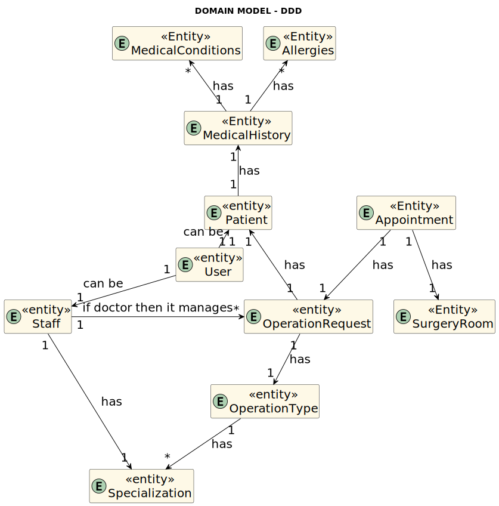
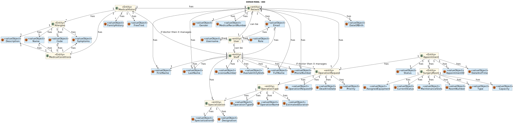
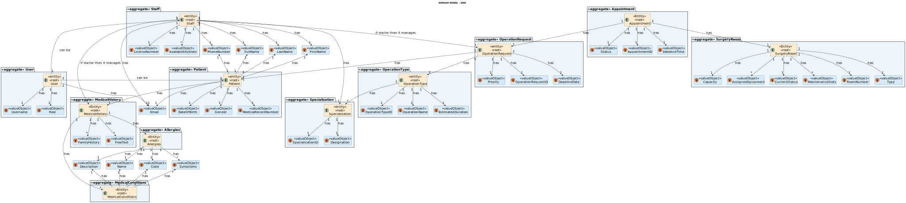

# Analysis

The process of building the domain model is based on the client's specifications, especially the nouns (for concepts) and verbs (for relationships) used.

## Rationale for identifying domain conceptual classes ##

To identify domain conceptual classes, start by making a list of candidate conceptual classes inspired by the list of categories suggested in the book "Applying UML and Patterns: An Introduction to Object-Oriented Analysis and Design and Iterative Development".

### **Rationale for identifying associations between conceptual classes** ###

An association is a relationship between instances of objects that indicates a relevant connection that is worth remembering, or is derivable from the Common Associations List:

| Concept (A)          | Association              | Concept (B)           |
|----------------------|--------------------------|------------------------|
| User                 | has                      | Patient               |
| User                 | has                      | Staff                 |
| User                 | has                      | Username              |
| User                 | has                      | Role                  |
| User                 | has                      | Email                 |
| Patient              | has                      | DateOfBirth           |
| Patient              | has                      | Gender                |
| Patient              | has                      | MedicalRecordNumber   |
| Patient              | has                      | FirstName             |
| Patient              | has                      | LastName              |
| Patient              | has                      | FullName              |
| Patient              | has                      | Email                 |
| Patient              | has                      | PhoneNumber           |
| Staff                | has                      | Specialization        |
| Staff                | manages (if doctor)      | OperationRequest      |
| Staff                | has                      | LicenseNumber         |
| Staff                | has                      | AvailabilititySlots   |
| Staff                | has                      | FirstName             |
| Staff                | has                      | LastName              |
| Staff                | has                      | FullName              |
| Staff                | has                      | Email                 |
| Staff                | has                      | PhoneNumber           |
| Specialization       | has                      | SpecializationID      |
| Specialization       | has                      | Designation           |
| OperationRequest     | has                      | OperationType         |
| OperationRequest     | has                      | Patient               |
| OperationRequest     | has                      | OperationRequestID    |
| OperationRequest     | has                      | DeadlineDate          |
| OperationRequest     | has                      | Priority              |
| OperationType        | has                      | Specialization        |
| OperationType        | has                      | OperationTypeID       |
| OperationType        | has                      | OperationName         |
| OperationType        | has                      | EstimatedDuration     |
| Appointment          | has                      | OperationRequest      |
| Appointment          | has                      | SurgeryRoom           |
| Appointment          | has                      | AppointmentID         |
| Appointment          | has                      | DateAndTime           |
| Appointment          | has                      | Status                |
| SurgeryRoom          | has                      | RoomNumber            |
| SurgeryRoom          | has                      | Type                  |
| SurgeryRoom          | has                      | Capacity              |
| SurgeryRoom          | has                      | AssignedEquipment     |
| SurgeryRoom          | has                      | CurrentStatus         |

## Domain Model

### Level 1

### Level 2

### Level 3

