# Design

## Logical View

### Level 1

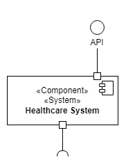

### Level 2

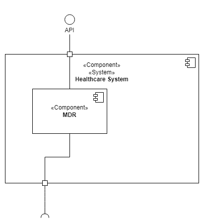

### Level 3

#### MDR Logical View 

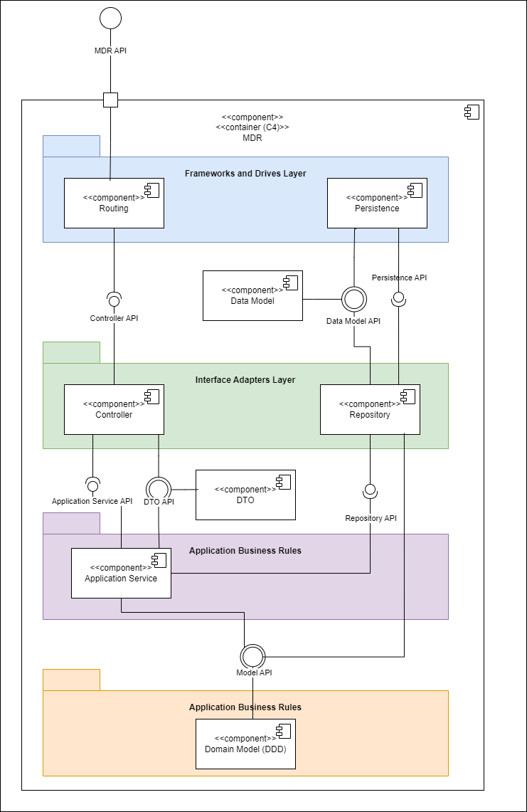

#### UI Logical View

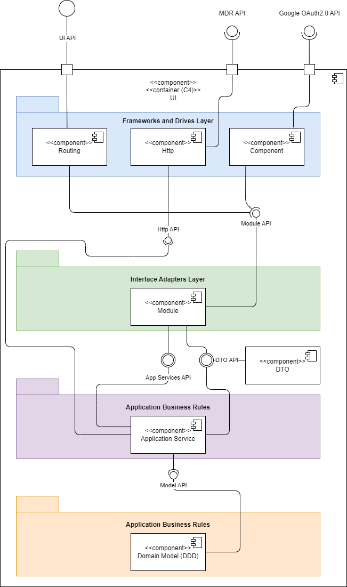

#### MDV Logical View

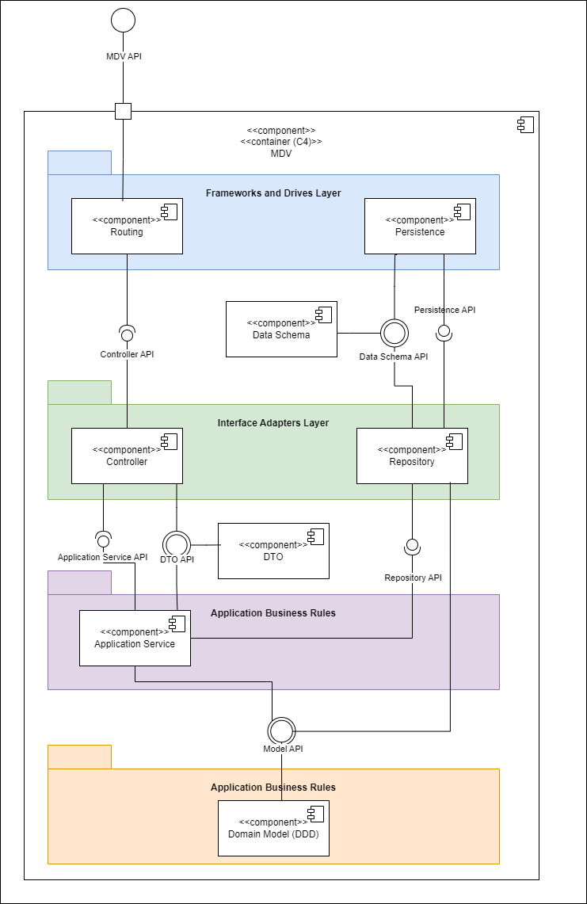

## Physical View

### Level 2

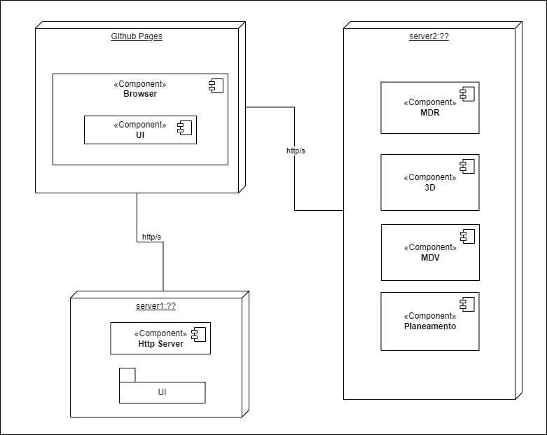

## Implementation View

### Level 2

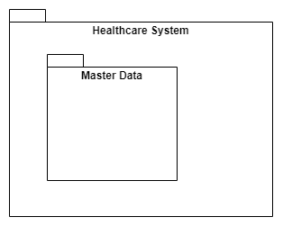

### Level 3

#### MDR Implementation View

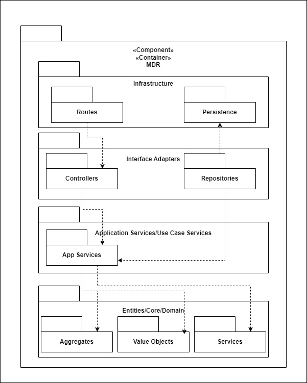

#### UI Implementation View

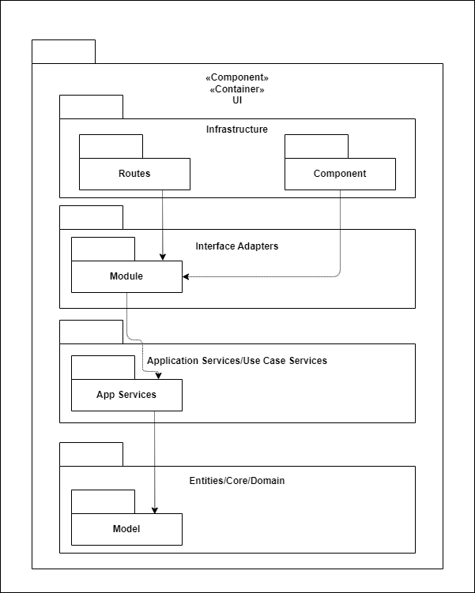

#### MDV Implementation View

## Mapping Between Views

### Level 2

#### Logical View to Implementation View

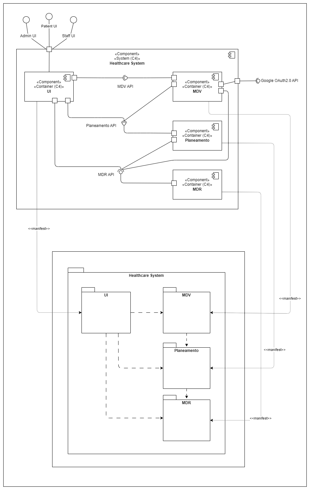

#### Implementation View to Physical View

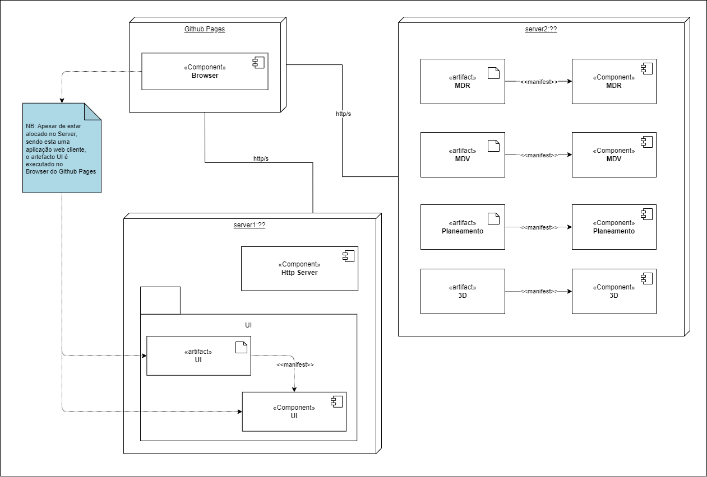

### Level 3 MDR

#### Logical View to Implementation View

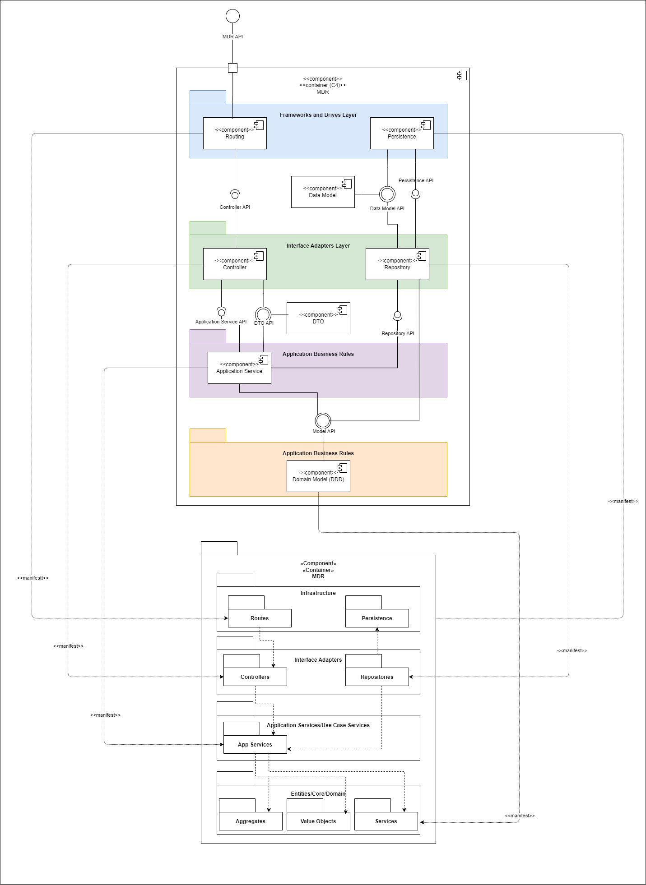

### Level 3 UI

#### Logical View to Implementation View

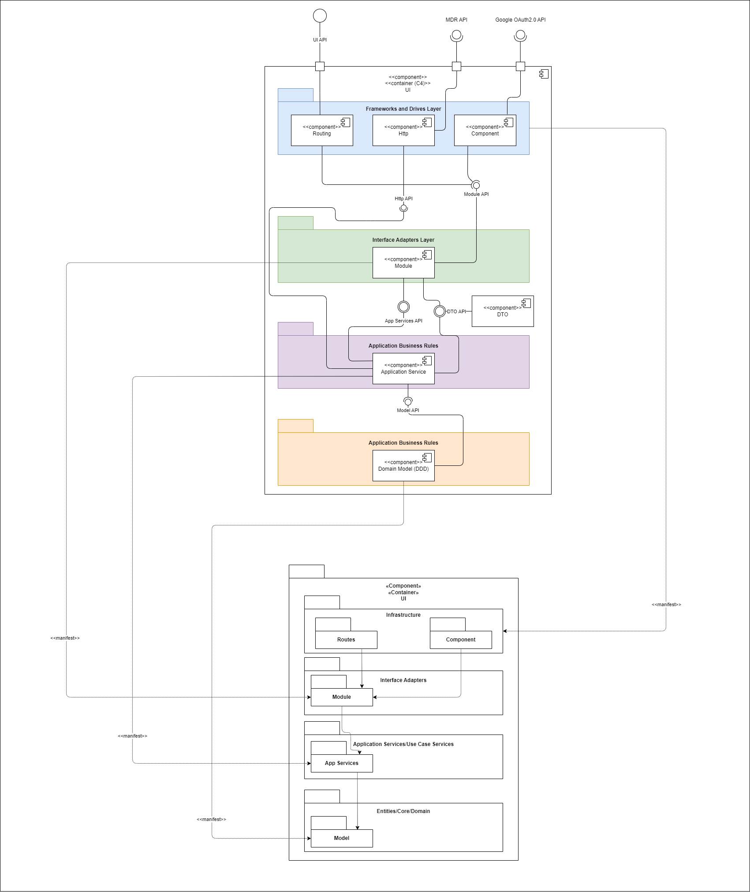

### Level 3 MDV

#### Logical View to Implementation View

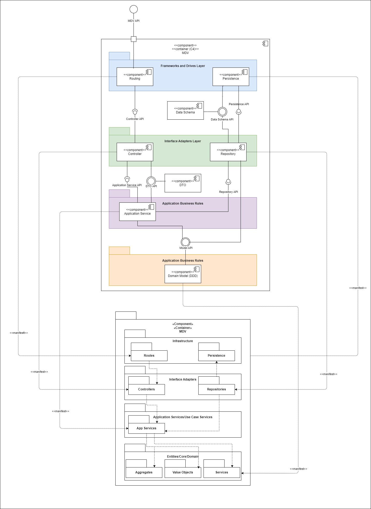

