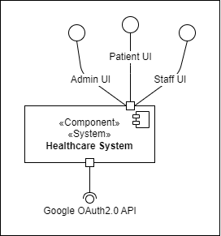
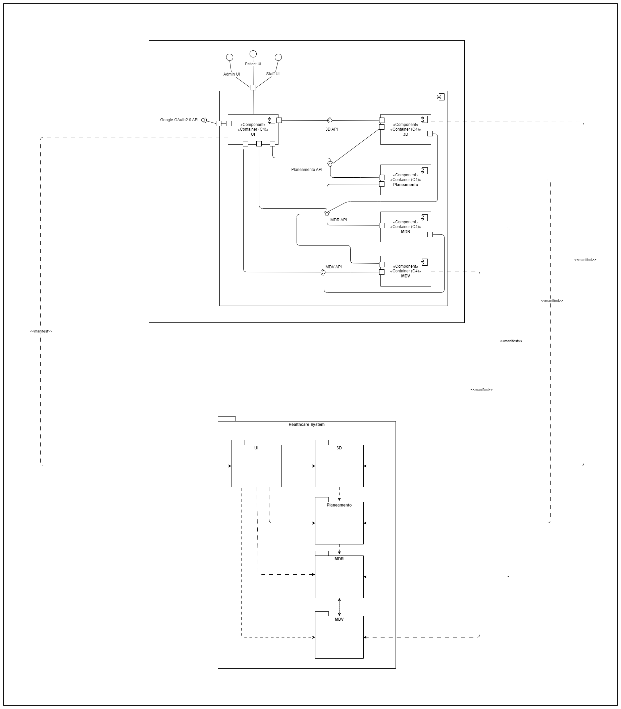

# Design

## Logical View

### Level 1

### Level 2

### Level 3

#### MDR Logical View 

#### UI Logical View

## Physical View

### Level 2

## Implementation View

### Level 2

### Level 3

#### MDR Implementation View

#### UI Implementation View

## Mapping Between Views

### Level 2

#### Logical View to Implementation View

#### Implementation View to Physical View

### Level 3 MDR

#### Logical View to Implementation View

#### Implementation View to Physical View

### Level 3 UI

#### Logical View to Implementation View

#### Implementation View to Physical View

