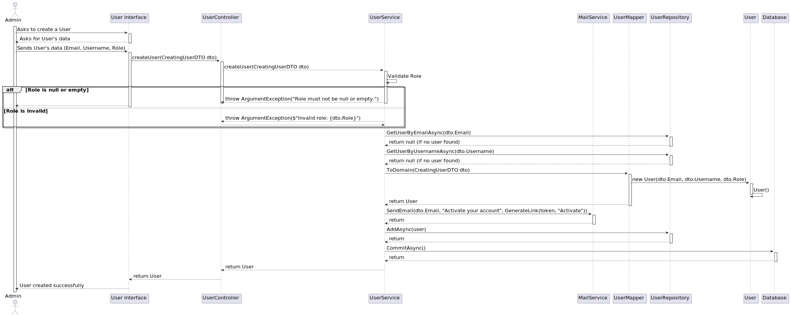

# US 5.1.1 - As an Admin, I want to register new backoffice users - POST

## 1. Context

 `Description:` As an Admin, I want to register new backoffice users (e.g., doctors, nurses, technicians, admins) via an out-of-band process, so that they can access the backoffice system with appropriate permissions.

Acceptance Criteria:

- Backoffice users (e.g., doctors, nurses, technicians) are registered by an Admin via an internal process, not via self-registration.
- Admin assigns roles (e.g., Doctor, Nurse, Technician) during the registration process.
- Registered users receive a one-time setup link via email to set their password and activate their account.
- The system enforces strong password requirements for security.
- A confirmation email is sent to verify the user’s registration.

 `Sprint:` This US makes part of the first stage of development of the integrative project of this semester, Sprint A.

`Objectives:` Register new users into the system

## Level 1

## Level 2

## Level 3

