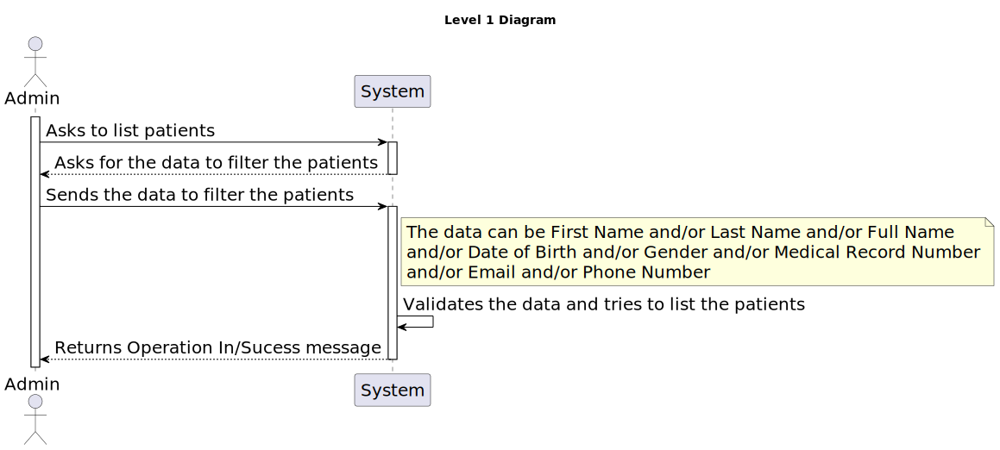
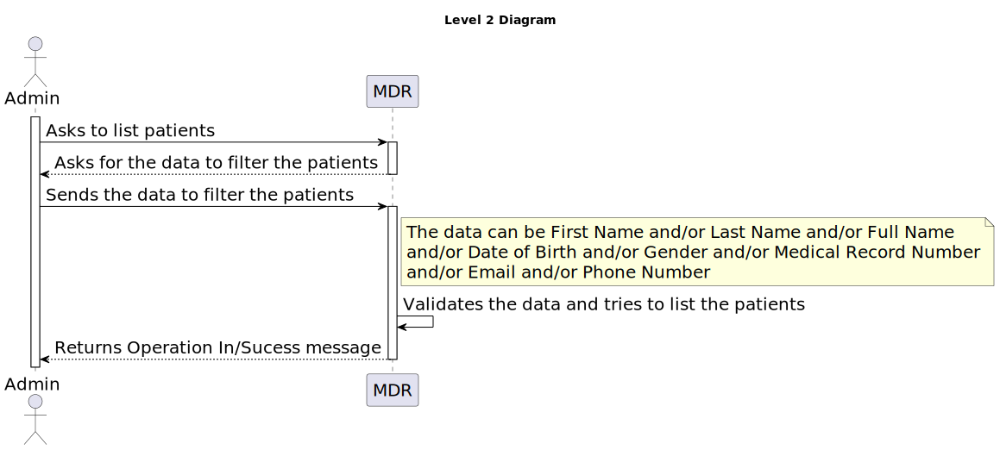
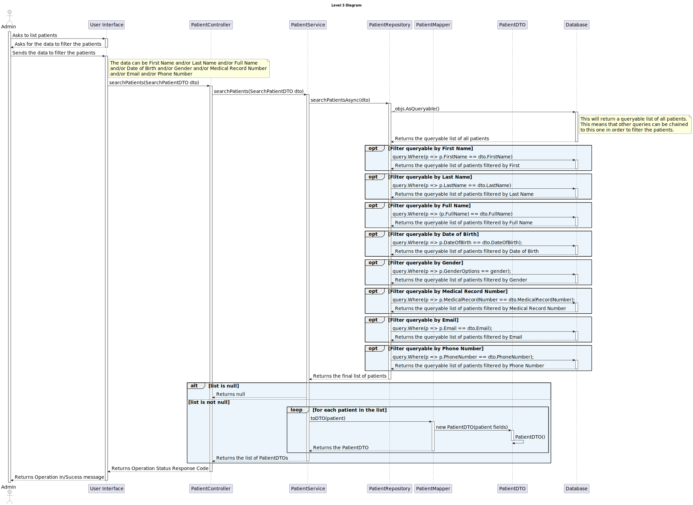

# US 5.1.11 - As an Admin, I want to list/search patient profiles by different attributes - GET

## 1. Context

 `Description:` As an Admin, I want to list/search patient profiles by different attributes, so that I can view the details, edit, and remove patient profiles.

Acceptance Criteria:

- Admins can search patient profiles by various attributes, including name, email, date of birth, or medical record number.
- The system displays search results in a list view with key patient information (name, email, date of birth).
- Admins can select a profile from the list to view, edit, or delete the patient record..
- The search results are paginated, and filters are available to refine the search results.

 `Sprint:` This US makes part of the first stage of development of the integrative project of this semester, Sprint A.

`Objectives:` The Admin can list and search patient profiles in order to manage them.

## Level 1

## Level 2

## Level 3

