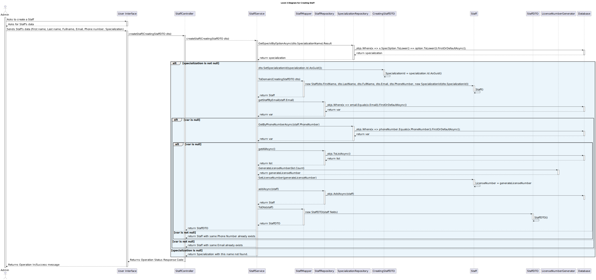

# US 5.1.12 - As an Admin, I want to create a new staff profile - POST

## 1. Context

 `Description:` As an Admin, I want to create a new staff profile, so that I can add them to the hospital’s roster.

Acceptance Criteria:

- Admins can input staff details such as first name, last name, contact information, and specialization.
- A unique staff ID (License Number) is generated upon profile creation.
- The system ensures that the staff’s email and phone number are unique.
- The profile is stored securely, and access is based on role-based permissions.

 `Sprint:` This US makes part of the first stage of development of the integrative project of this semester, Sprint A.

`Objectives:` The Admin can create a new staff profile at any time.

## Level 1

## Level 2

## Level 3

