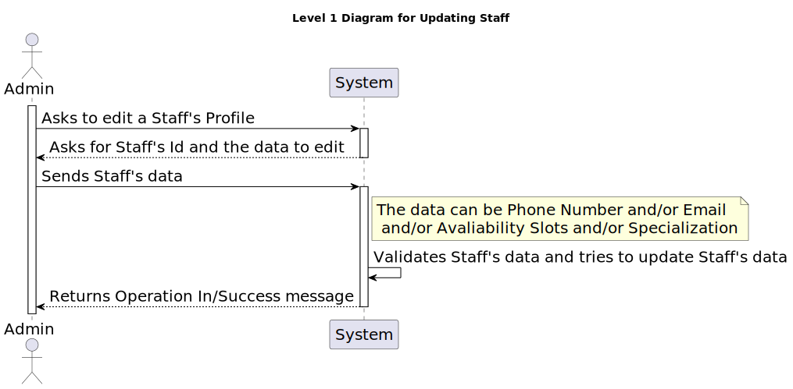
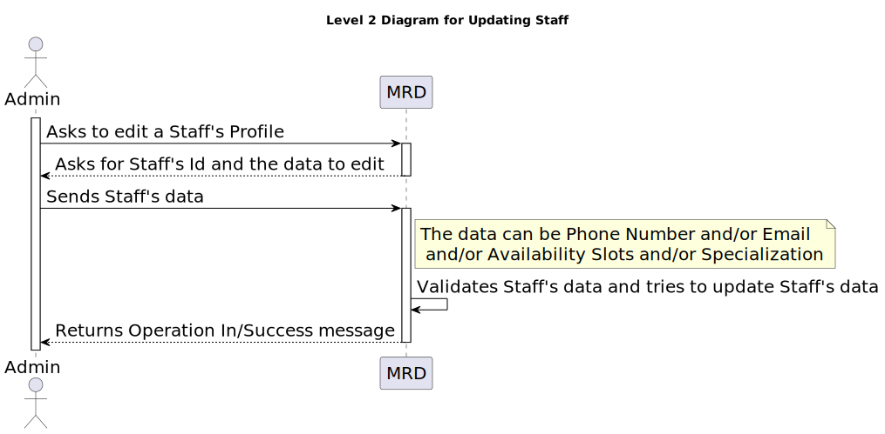
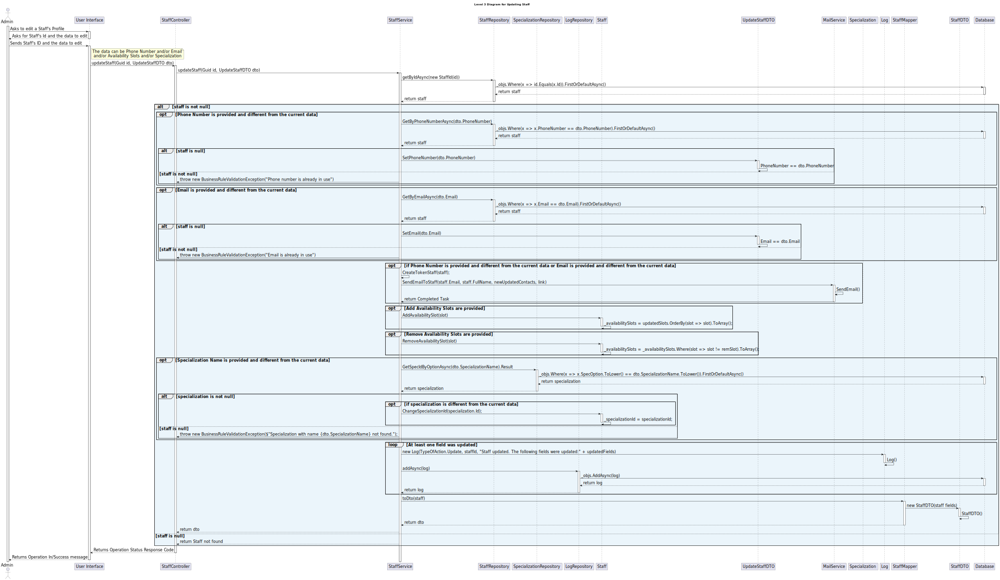

# US 5.1.13 - As an Admin, I want to edit a staff’s profile - PUT/PATCH

## 1. Context

 `Description:` As an Admin, I want to edit a staff’s profile, so that I can update their information.

Acceptance Criteria:

- Admins can search for and select a staff profile to edit.
- Editable fields include contact information, availability slots, and specialization.
- The system logs all profile changes, and any changes to contact information trigger a confirmation email to the staff member.
- The edited data is updated in real-time across the system.

 `Sprint:` This US makes part of the first stage of development of the integrative project of this semester, Sprint A.

`Objectives:` The Admin can edit staff profiles.

## Level 1

## Level 2

## Level 3

