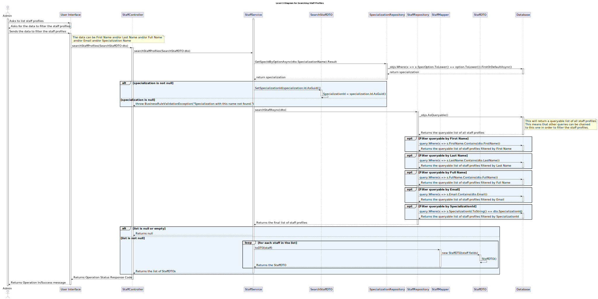

# US 5.1.15 - As an Admin, I want to list/search staff profiles - GET

## 1. Context

 `Description:` As an Admin, I want to list/search staff profiles, so that I can see the details, edit, and remove staff profiles.

Acceptance Criteria:

- Admins can search staff profiles by attributes such as name, email, or specialization.
- The system displays search results in a list view with key staff information (name, email, specialization).
- Admins can select a profile from the list to view, edit, or deactivate.
- The search results are paginated, and filters are available for refining the search results.

 `Sprint:` This US makes part of the first stage of development of the integrative project of this semester, Sprint A.

`Objectives:` The Admin can list and search staff profiles in order to manage them.

## Level 1

## Level 2

## Level 3

