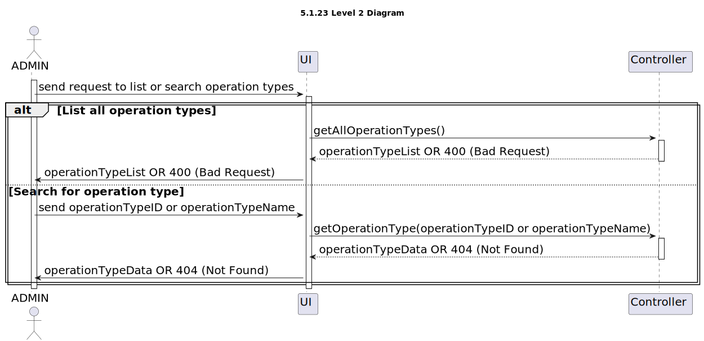

# US 5.1.23 - As an Admin, I want to list/search operation types - GET

## 1. Context

 `Description:` As an Admin, I want to list/search operation types, so that I can see the details, edit, and remove operation types.

Acceptance Criteria:

- Admins can search and filter operation types by name, specialization, or status (active/inactive).
- The system displays operation types in a searchable list with attributes such as name, required staff, and estimated duration.
- Admins can select an operation type to view, edit, or deactivate it.

 `Sprint:` This US makes part of the first stage of development of the integrative project of this semester, Sprint A.

`Objectives:` The Admin can list and search operation types in order to manage them.

## Level 1

## Level 2

## Level 3

