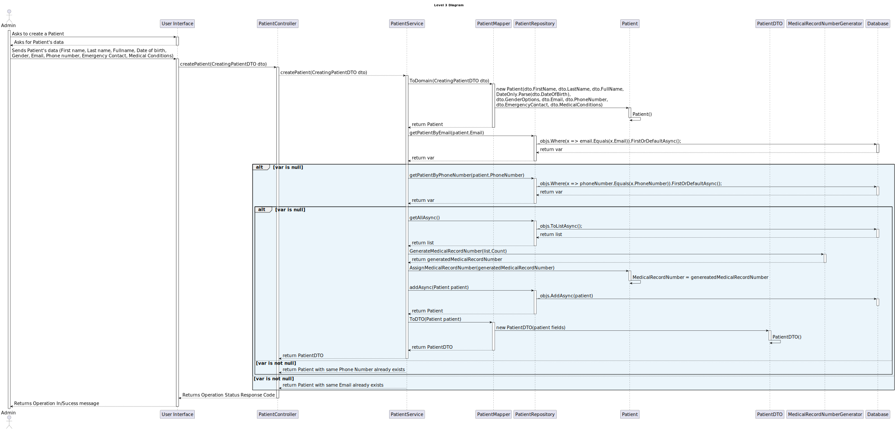

# US 5.1.8 -  As an Admin, I want to create a new patient profile - POST

## 1. Context

 `Description:` As an Admin, I want to create a new patient profile, so that I can register their personal details and medical history.

Acceptance Criteria:

- Admins can input patient details such as first name, last name, date of birth, contact information, and medical history.
- A unique patient ID (Medical Record Number) is generated upon profile creation.
- The system validates that the patient’s email and phone number are unique.
- The profile is stored securely in the system, and access is governed by role-based permissions.

 `Sprint:` This US makes part of the first stage of development of the integrative project of this semester, Sprint A.

`Objectives:` Admin can creates new patient profiles.

## Level 1

## Level 2

## Level 3

