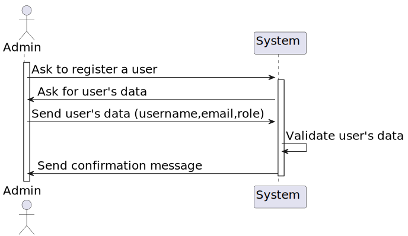

# 6.1.4 - As Admin, I want the synchronization between information of the Planning and the Backoffice modules

## 1. Context

 `Description:` As Admin, I want the information about healthcare staff, operation types, and operation requests used in the planning module to be in sync with the information entered in the backoffice module.

 `Sprint:` This US makes part of the first stage of development of the integrative project of this semester, Sprint B.

`Objectives:` This user story aims to synchronize the information of the planning module with the backoffice module.

## Level 1

## Level 2

## Level 3

