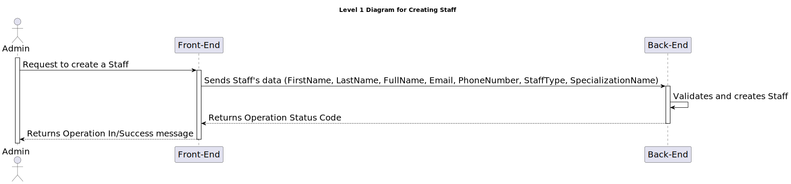
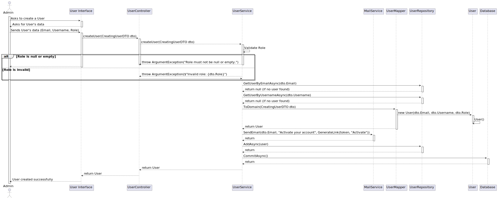

# 6.2.10 - As an Admin, I want to create a new staff profile

## 1. Context

 `Description:` As an Admin, I want to create a new staff profile, so that I can add them to the hospital’s roster.

 `Sprint:` This US makes part of the second stage of development of the integrative project of this semester, Sprint B.

`Objectives:` This user story aims to develop the UI for the staff profile creation process for the healthcare application, so that the Admin can create a new staff profile.

## Level 1

## Level 2

## Level 3

