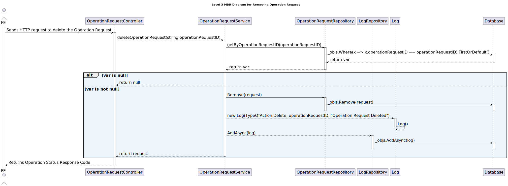
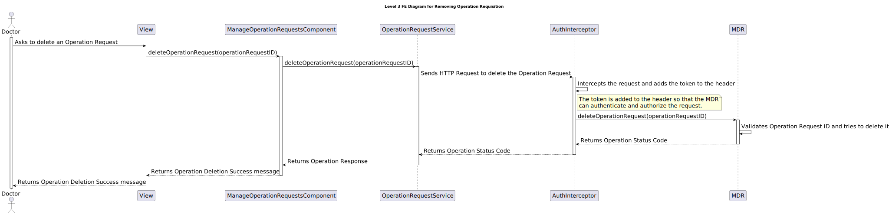

# 6.2.16 - As a Doctor, I want to remove an operation requisition

## 1. Context

 `Description:` As a Doctor, I want to remove an operation requisition, so that the healthcare activities are provided as necessary.

 `Sprint:` This US makes part of the second stage of development of the integrative project of this semester, Sprint B.

`Objectives:` This user story aims to develop the UI for the operation requisition removal process for the healthcare application, so that the Doctor can remove the operation requisition.

## Level 1

## Level 2

## Level 3

### MDR

### FE

