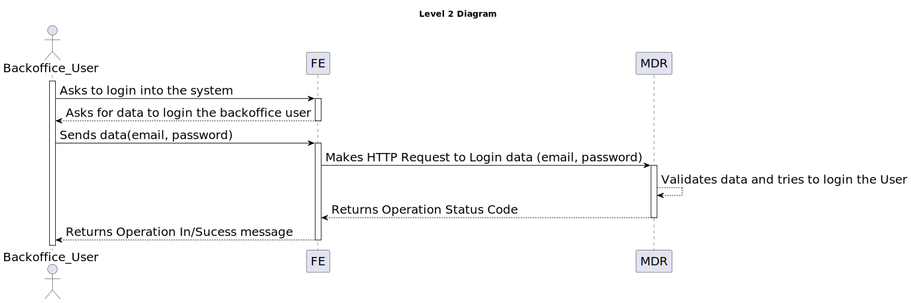

# 6.2.4 - As a (non-authenticated) Backoffice User, I want to log in to the system

## 1. Context

 `Description:` As a (non-authenticated) Backoffice User, I want to log in to the system using my credentials, so that I can access the backoffice features according to my assigned role.

 `Sprint:` This US makes part of the second stage of development of the integrative project of this semester, Sprint B.

`Objectives:` This user story aims to develop the UI for the login process for the backoffice application, so that the (non-authenticated) Backoffice User can log in to the system.

## Level 1

## Level 2

## Level 3

