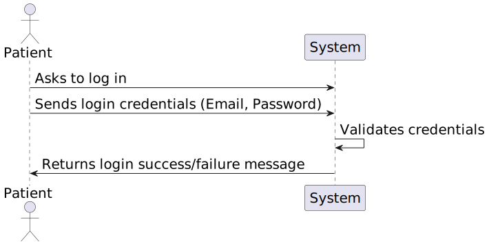
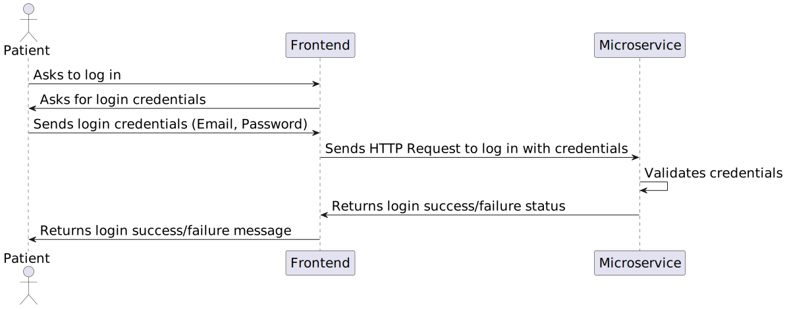

# 6.2.5 - As a Patient, I want to log in to the healthcare system

## 1. Context

 `Description:` As a Patient, I want to log in to the healthcare system, so that I can access my appointments, medical records, and other features securely.

 `Sprint:` This US makes part of the second stage of development of the integrative project of this semester, Sprint B.

`Objectives:` This user story aims to develop the UI for the login process for the healthcare application, so that the Patient can log in to the healthcare system.

## Level 1

## Level 2

## Level 3

