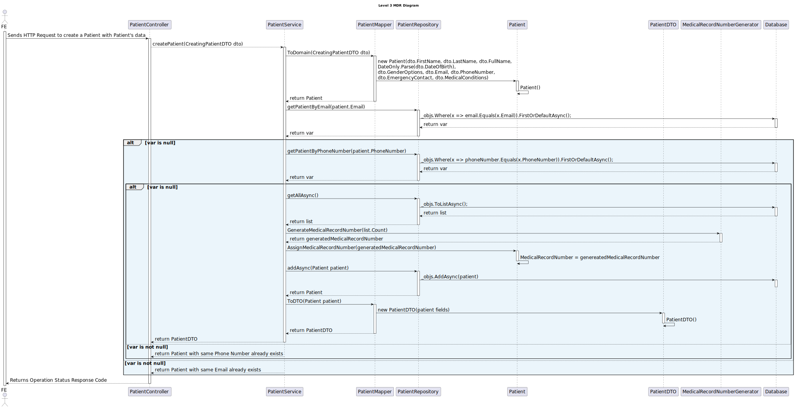
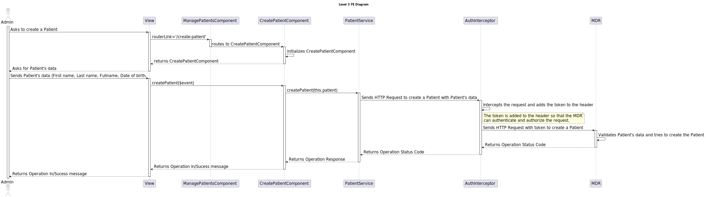

# 6.2.6 - As an Admin, I want to create a new patient profile

## 1. Context

 `Description:` As an Admin, I want to create a new patient profile, so that I can register their personal details and medical history.

 `Sprint:` This US makes part of the first stage of development of the integrative project of this semester, Sprint B.

`Objectives:` This user story aims to develop the UI for the patient profile creation process for the healthcare application, so that the Admin can create a new patient profile.

## Level 1

## Level 2

## Level 3

### MDR

### FE

