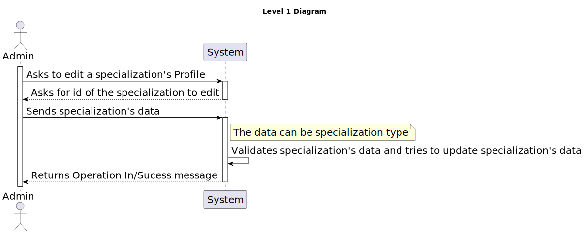
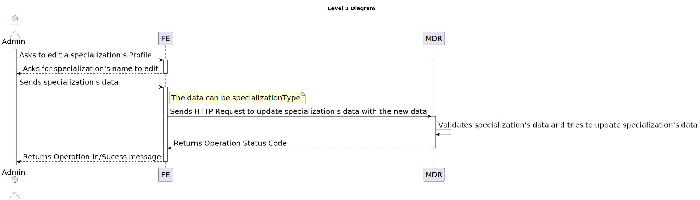
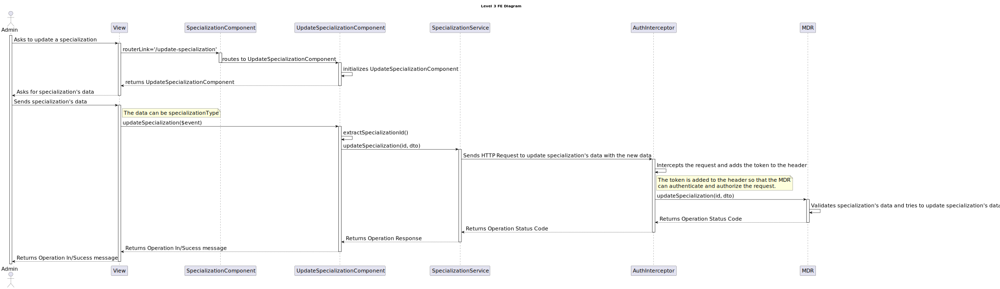

# 7.2.13 - As an Admin, I want to edit Specializations

## 1. Context

 `Description:` As an Admin, I want to edit Specializations, so that I can update or correct
information about the staff and operation type (procedure).

 `Sprint:` This US makes part of the third stage of development of the integrative project of this semester, Sprint C.

`Objectives:` This US aims to implement the edit functionality for Specializations in the system.

## Level 1

## Level 2

## Level 3

### MDR

### FE

