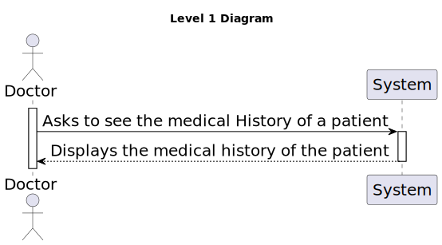
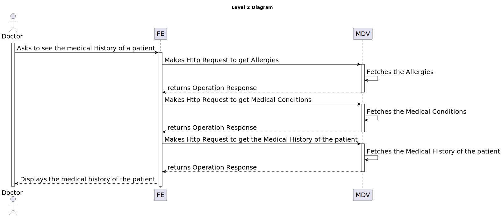
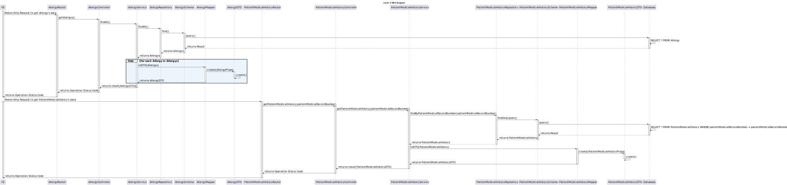

# 7.2.14 - As a Doctor, I want to include the access of the Patient Medical Record

## 1. Context

 `Description:` As a Doctor, I want to include the access of the Patient Medical Record during the patient profile visualization and management, so that I manage it in that context.

 `Sprint:` This US makes part of the final stage of development of the integrative project of this semester, Sprint C.

`Objectives:` This US aims to implement the access to the Patient Medical Record in the Patient Profile visualization and management.

## Level 1

## Level 2

## Level 3

### FE

### MDV

