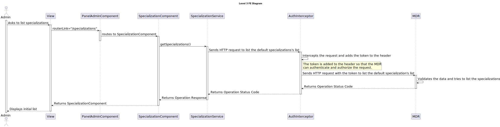

# 7.2.15 As an Admin, I want to list/search Specializations

## 1. Context

 `Description:` As an Admin, I want to list/search Specializations, so that I can see the details, and
edit and remove Specializations.

 `Sprint:` This US makes part of the third stage of development of the integrative project of this semester, Sprint C.

`Objectives:` This US aims to implement the list/search functionality for Specializations in the system.

## Level 1

## Level 2

## Level 3

### MDR

### FE

