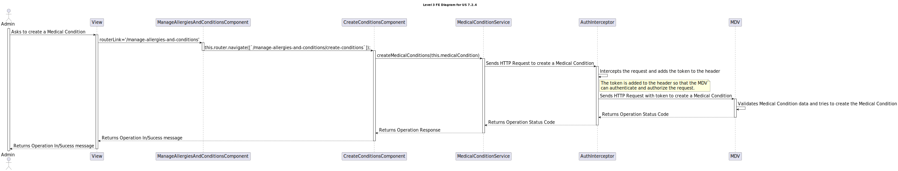
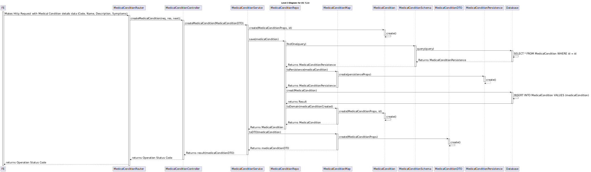

# 7.2.4 - As an Admin, I want to add new Medical Condition

## 1. Context

 `Description:` As an Admin, I want to add new Medical Condition, so that the Doctors can use it to update the Patient Medical Record.

 `Sprint:` This US makes part of the final stage of development of the integrative project of this semester, Sprint C.

`Objectives:` This US aims to implement a functionality that allows an Admin to add new Medical Conditions to the system. The goal is to ensure that doctors have up-to-date information to update the Patient Medical Record.

## Level 1

## Level 2

## Level 3

### FE

### MDV

