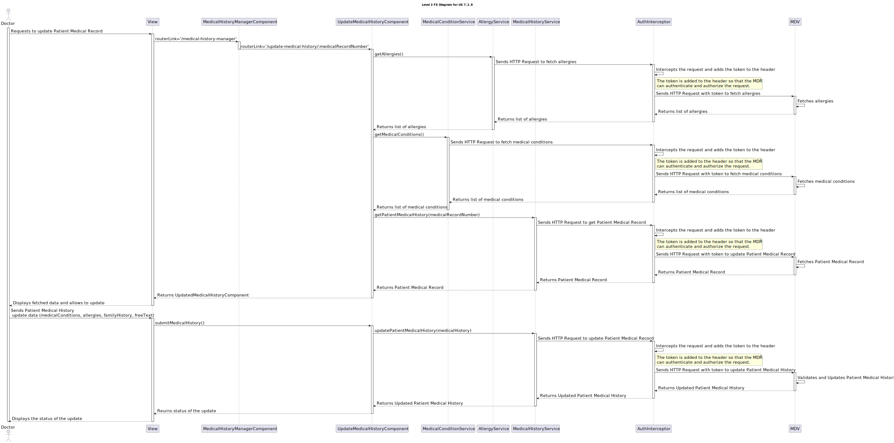
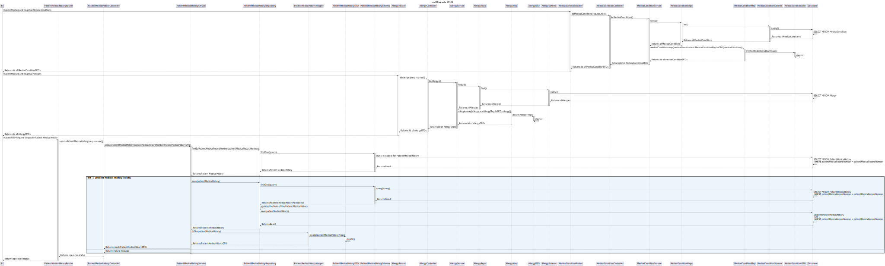

# 7.2.6 - As a Doctor, I want to update the Patient Medical Record

## 1. Context

 `Description:` As a Doctor, I want to update the Patient Medical Record, namely respecting Medical Conditions and Allergies.

 `Sprint:` This US makes part of the final stage of development of the integrative project of this semester, Sprint C.

`Objectives:` This US aims to implement a functionality within the Patient Medical Record system that allows doctors to update specific entries related to Medical Conditions and Allergies. The goal is to ensure that the Patient Medical Record is accurate and up-to-date.

## Level 1

## Level 2

## Level 3

### FE

### MDV

